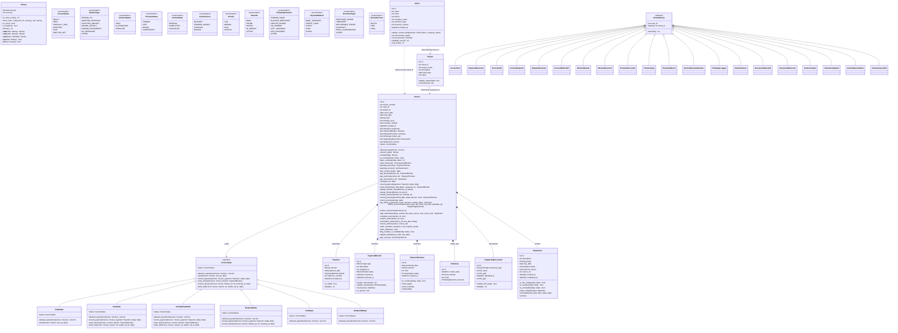

# UML Diagram 02 — Domain Class Diagram

```mermaid
classDiagram
    class Money {
        +Decimal amount
        +str currency
        +to_minor_units() int
        +from_minor_units(units: int, currency: str) Money
        +is_zero() bool
        +is_positive() bool
        +format() str
        +__add__(other: Money) Money
        +__sub__(other: Money) Money
        +__mul__(factor: Decimal) Money
        +__eq__(other: Money) bool
        +__lt__(other: Money) bool
    }

    class InvoiceStatus {
        <<enumeration>>
        DRAFT
        SENT
        PARTIALLY_PAID
        DISPUTED
        PAID
        WRITTEN_OFF
    }

    class BlockerType {
        <<enumeration>>
        MISSING_PO
        AWAITING_APPROVAL
        DISPUTED_AMOUNT
        WRONG_DETAILS
        MISSING_DOCUMENTS
        NO_RESPONSE
        OTHER
    }

    class BlockerStatus {
        <<enumeration>>
        OPEN
        IN_PROGRESS
        RESOLVED
    }

    class PromiseStatus {
        <<enumeration>>
        PENDING
        KEPT
        MISSED
        SUPERSEDED
    }

    class ActionStatus {
        <<enumeration>>
        PENDING
        COMPLETED
        CANCELLED
    }

    class ActionSource {
        <<enumeration>>
        BLOCKER
        PROMISE_MISSED
        OVERDUE
        MANUAL
    }

    class Priority {
        <<enumeration>>
        LOW
        MEDIUM
        HIGH
        CRITICAL
    }

    class Channel {
        <<enumeration>>
        EMAIL
        PHONE
        PORTAL
        IN_PERSON
        LETTER
    }

    class FollowUpOutcome {
        <<enumeration>>
        PROMISE_MADE
        BLOCKER_IDENTIFIED
        DISPUTE_RAISED
        NO_ANSWER
        LEFT_VOICEMAIL
        INFO_PROVIDED
        OTHER
    }

    class PaymentMethod {
        <<enumeration>>
        BANK_TRANSFER
        CREDIT_CARD
        CHECK
        CASH
        OTHER
    }

    class DocumentType {
        <<enumeration>>
        PURCHASE_ORDER
        TIMESHEET
        DELIVERABLE_PROOF
        CONTRACT
        EMAIL_CONFIRMATION
        OTHER
    }

    class ReminderTone {
        <<enumeration>>
        POLITE
        FIRM
        FINAL
    }

    class Client {
        +str id
        +str name
        +str email
        +str phone
        +str company_name
        +int promises_kept
        +int promises_missed
        +datetime created_at
        +update_contact_details(name, email, phone, company_name)
        +record_promise_kept()
        +record_promise_missed()
        +reliability_score() int
        +risk_level() str
    }

    class Project {
        +str id
        +str client_id
        +str project_name
        +str description
        +date start_date
        +str status
        +update_status(status: str)
        +rename(name: str)
    }

    class Payment {
        +str id
        +Money amount
        +date payment_date
        +PaymentMethod method
        +str reference_number
        +datetime recorded_at
        +is_valid() bool
        +details() str
    }

    class PaymentBlocker {
        +str id
        +BlockerType type
        +str description
        +str assigned_to
        +BlockerStatus status
        +datetime created_at
        +datetime resolved_at
        +assign_owner(owner: str)
        +update_status(status: BlockerStatus)
        +resolve(now: datetime)
        +is_open() bool
    }

    class PaymentPromise {
        +str id
        +date promised_date
        +Money amount
        +str note
        +PromiseStatus status
        +datetime created_at
        +is_overdue(today: date) bool
        +mark_kept()
        +mark_missed()
        +supersede()
    }

    class FollowUp {
        +str id
        +datetime contact_date
        +Channel channel
        +str notes
        +FollowUpOutcome outcome
    }

    class SupportingDocument {
        +str id
        +DocumentType document_type
        +str file_name
        +str file_path
        +datetime uploaded_at
        +str file_type
        +validate_file_type() bool
        +details() str
    }

    class NextAction {
        +str id
        +str description
        +Priority priority
        +date due_date
        +ActionStatus status
        +ActionSource source
        +str source_ref
        +datetime created_at
        +datetime completed_at
        +is_due_today(today: date) bool
        +is_overdue(today: date) bool
        +is_actionable(today: date) bool
        +mark_completed(now: datetime)
        +reschedule(new_date: date, today: date)
        +cancel()
    }

    class Invoice {
        +str id
        +str invoice_number
        +str client_id
        +str project_id
        +date issue_date
        +date due_date
        +Money total
        +int reminder_level
        +bool overdue_notified
        +datetime created_at
        +list~Payment~ payments
        +list~PaymentBlocker~ blockers
        +list~PaymentPromise~ promises
        +list~FollowUp~ follow_ups
        +list~SupportingDocument~ documents
        +list~NextAction~ actions
        +status: InvoiceStatus
        +allowed_operations() set~str~
        +amount_paid() Money
        +outstanding() Money
        +is_overdue(today: date) bool
        +days_overdue(today: date) int
        +open_blockers() list~PaymentBlocker~
        +pending_promise() PaymentPromise
        +pending_actions() list~NextAction~
        +last_contact_date() date
        +get_blocker(blocker_id) PaymentBlocker
        +get_promise(promise_id) PaymentPromise
        +get_action(action_id) NextAction
        +send(sent_at: date)
        +record_payment(payment: Payment, today: date)
        +raise_blocker(type, description, assigned_to) PaymentBlocker
        +update_blocker_status(blocker_id, status)
        +assign_blocker(blocker_id, owner)
        +resolve_blocker(blocker_id, resolved_at)
        +record_promise(promised_date, today, amount, note) PaymentPromise
        +check_promises(today: date)
        +log_follow_up(channel, notes, outcome, contact_date) FollowUp
        +attach_document(document_type, file_name, file_path, uploaded_at) SupportingDocument
        +remove_document(document_id)
        +add_action(description, priority, due_date, source, now, source_ref) NextAction
        +complete_action(action_id, now)
        +reopen_action(action_id, now)
        +reschedule_action(action_id, new_date, today)
        +cancel_actions(source, source_ref)
        +mark_reminder_sent(tone, now, recipient_email)
        +write_off(reason, now)
        +flag_overdue_if_needed(today: date) bool
        +update_details(issue_date, due_date)
        +pull_events() list~DomainEvent~
    }

    class InvoiceState {
        <<abstract>>
        +status: InvoiceStatus*
        +allowed_operations(invoice: Invoice)* set~str~
        +send(invoice: Invoice, sent_at: date)
        +record_payment(invoice: Invoice, payment: Payment, today: date)
        +raise_blocker(invoice: Invoice, blocker: PaymentBlocker)
        +resolve_blocker(invoice: Invoice, blocker_id: str, resolved_at: date)
        +write_off(invoice: Invoice, reason: str, written_off_at: date)
    }

    class DraftState {
        +status: InvoiceStatus
        +allowed_operations(invoice: Invoice) set~str~
        +send(invoice: Invoice, sent_at: date)
    }

    class SentState {
        +status: InvoiceStatus
        +allowed_operations(invoice: Invoice) set~str~
        +record_payment(invoice: Invoice, payment: Payment, today: date)
        +raise_blocker(invoice: Invoice, blocker: PaymentBlocker)
        +write_off(invoice: Invoice, reason: str, written_off_at: date)
    }

    class PartiallyPaidState {
        +status: InvoiceStatus
        +allowed_operations(invoice: Invoice) set~str~
        +record_payment(invoice: Invoice, payment: Payment, today: date)
        +raise_blocker(invoice: Invoice, blocker: PaymentBlocker)
        +write_off(invoice: Invoice, reason: str, written_off_at: date)
    }

    class DisputedState {
        +status: InvoiceStatus
        +allowed_operations(invoice: Invoice) set~str~
        +record_payment(invoice: Invoice, payment: Payment, today: date)
        +resolve_blocker(invoice: Invoice, blocker_id: str, resolved_at: date)
    }

    class PaidState {
        +status: InvoiceStatus
        +allowed_operations(invoice: Invoice) set~str~
    }

    class WrittenOffState {
        +status: InvoiceStatus
        +allowed_operations(invoice: Invoice) set~str~
    }

    InvoiceState <|-- DraftState
    InvoiceState <|-- SentState
    InvoiceState <|-- PartiallyPaidState
    InvoiceState <|-- DisputedState
    InvoiceState <|-- PaidState
    InvoiceState <|-- WrittenOffState

    Invoice --> InvoiceState : _state
    Invoice *-- Payment : payments
    Invoice *-- PaymentBlocker : blockers
    Invoice *-- PaymentPromise : promises
    Invoice *-- FollowUp : follow_ups
    Invoice *-- SupportingDocument : documents
    Invoice *-- NextAction : actions

    Client "1" ..> "*" Invoice : referenced by client_id
    Client "1" ..> "*" Project : referenced by client_id
    Project "0..1" ..> "*" Invoice : referenced by project_id

    class DomainEvent {
        <<abstract>>
        +str event_id
        +datetime occurred_at
        +describe()* str
    }

    class InvoiceSent
    class PaymentReceived
    class InvoicePaid
    class InvoiceDisputed
    class DisputeResolved
    class InvoiceWrittenOff
    class BlockerRaised
    class BlockerResolved
    class PromiseRecorded
    class PromiseKept
    class PromiseMissed
    class InvoiceBecameOverdue
    class FollowUpLogged
    class ReminderSent
    class DocumentAttached
    class DocumentRemoved
    class ActionCreated
    class ActionCompleted
    class ActionRescheduled
    class ActionsCancelled

    DomainEvent <|-- InvoiceSent
    DomainEvent <|-- PaymentReceived
    DomainEvent <|-- InvoicePaid
    DomainEvent <|-- InvoiceDisputed
    DomainEvent <|-- DisputeResolved
    DomainEvent <|-- InvoiceWrittenOff
    DomainEvent <|-- BlockerRaised
    DomainEvent <|-- BlockerResolved
    DomainEvent <|-- PromiseRecorded
    DomainEvent <|-- PromiseKept
    DomainEvent <|-- PromiseMissed
    DomainEvent <|-- InvoiceBecameOverdue
    DomainEvent <|-- FollowUpLogged
    DomainEvent <|-- ReminderSent
    DomainEvent <|-- DocumentAttached
    DomainEvent <|-- DocumentRemoved
    DomainEvent <|-- ActionCreated
    DomainEvent <|-- ActionCompleted
    DomainEvent <|-- ActionRescheduled
    DomainEvent <|-- ActionsCancelled
```
