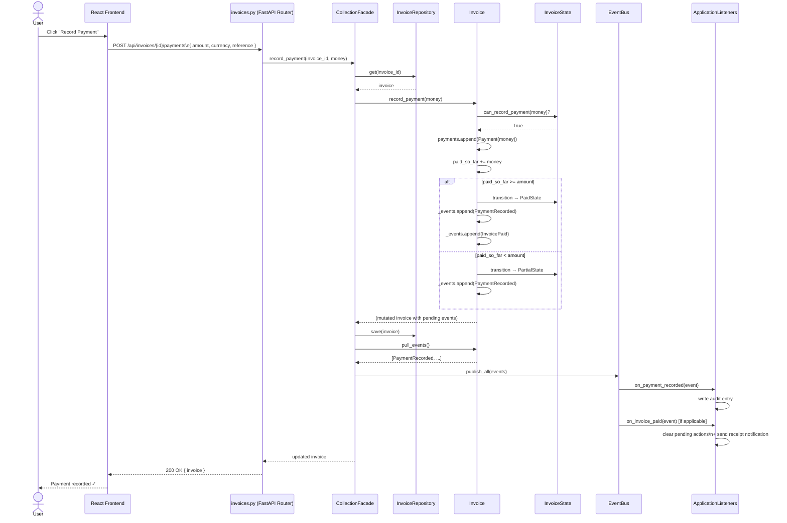

# UML Diagram 05 — Sequence: Record Payment

```mermaid
sequenceDiagram
    actor User
    participant UI as React Frontend
    participant Router as invoices.py (FastAPI Router)
    participant Facade as CollectionFacade
    participant InvoiceRepo as InvoiceRepository
    participant Inv as Invoice
    participant State as InvoiceState
    participant Bus as EventBus
    participant Listener as ApplicationListeners

    User ->> UI: Click "Record Payment"
    UI ->> Router: POST /api/invoices/{id}/payments\n{ amount, currency, reference }
    Router ->> Facade: record_payment(invoice_id, money)
    Facade ->> InvoiceRepo: get(invoice_id)
    InvoiceRepo -->> Facade: invoice
    Facade ->> Inv: record_payment(money)
    Inv ->> State: can_record_payment(money)?
    State -->> Inv: True
    Inv ->> Inv: payments.append(Payment(money))
    Inv ->> Inv: paid_so_far += money
    alt paid_so_far >= amount
        Inv ->> State: transition → PaidState
        Inv ->> Inv: _events.append(PaymentRecorded)
        Inv ->> Inv: _events.append(InvoicePaid)
    else paid_so_far < amount
        Inv ->> State: transition → PartialState
        Inv ->> Inv: _events.append(PaymentRecorded)
    end
    Inv -->> Facade: (mutated invoice with pending events)
    Facade ->> InvoiceRepo: save(invoice)
    Facade ->> Inv: pull_events()
    Inv -->> Facade: [PaymentRecorded, ...]
    Facade ->> Bus: publish_all(events)
    Bus ->> Listener: on_payment_recorded(event)
    Listener ->> Listener: write audit entry
    Bus ->> Listener: on_invoice_paid(event) [if applicable]
    Listener ->> Listener: clear pending actions\n+ send receipt notification
    Facade -->> Router: updated invoice
    Router -->> UI: 200 OK { invoice }
    UI -->> User: Payment recorded ✓
```
