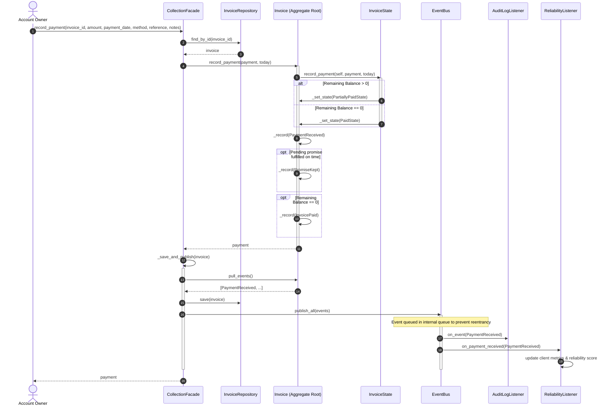

# UML Diagram 05 — Sequence: Record Payment

Traces the call path when an Account Owner records a payment against an invoice via `CollectionFacade.record_payment`.

```mermaid
sequenceDiagram
    autonumber
    actor User as Account Owner
    participant Facade as CollectionFacade
    participant Repo as InvoiceRepository
    participant Inv as Invoice (Aggregate Root)
    participant State as InvoiceState
    participant Bus as EventBus
    participant Audit as AuditLogListener
    participant Rel as ReliabilityListener

    User ->> Facade: record_payment(invoice_id, amount, payment_date, method, reference, notes)
    Facade ->> Repo: find_by_id(invoice_id)
    Repo -->> Facade: invoice

    Facade ->> Inv: record_payment(payment, today)
    activate Inv
    Inv ->> State: record_payment(self, payment, today)
    activate State
    alt Remaining Balance > 0
        State ->> Inv: _set_state(PartiallyPaidState)
    else Remaining Balance == 0
        State ->> Inv: _set_state(PaidState)
    end
    deactivate State

    Inv ->> Inv: _record(PaymentReceived)
    opt Pending promise fulfilled on time
        Inv ->> Inv: _record(PromiseKept)
    end
    opt Remaining Balance == 0
        Inv ->> Inv: _record(InvoicePaid)
    end
    Inv -->> Facade: payment
    deactivate Inv

    Facade ->> Facade: _save_and_publish(invoice)
    activate Facade
    Facade ->> Inv: pull_events()
    Inv -->> Facade: [PaymentReceived, ...]
    Facade ->> Repo: save(invoice)

    Facade ->> Bus: publish_all(events)
    activate Bus
    Note over Bus: Event queued in internal queue to prevent reentrancy
    Bus ->> Audit: on_event(PaymentReceived)
    Bus ->> Rel: on_payment_received(PaymentReceived)
    Rel ->> Rel: update client metrics & reliability score
    deactivate Bus
    deactivate Facade

    Facade -->> User: payment
```
