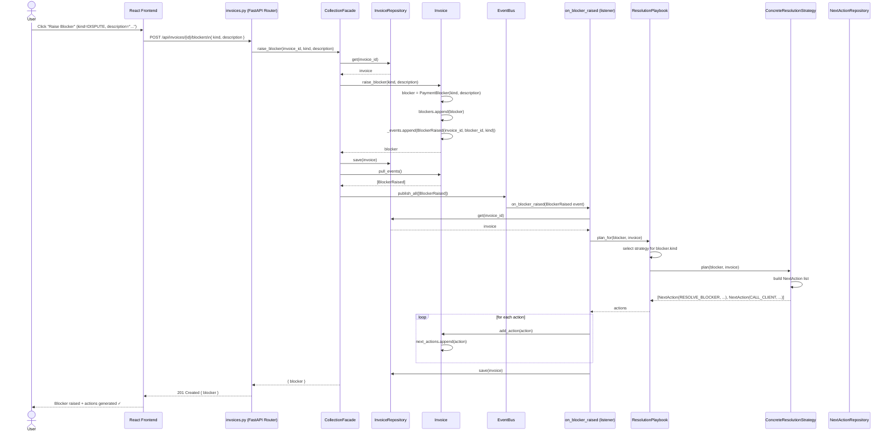

# UML Diagram 06 — Sequence: Blocker to Action (Raise Blocker → NextAction)

```mermaid
sequenceDiagram
    actor User
    participant UI as React Frontend
    participant Router as invoices.py (FastAPI Router)
    participant Facade as CollectionFacade
    participant InvoiceRepo as InvoiceRepository
    participant Inv as Invoice
    participant Bus as EventBus
    participant Listener as on_blocker_raised (listener)
    participant Playbook as ResolutionPlaybook
    participant Strategy as ConcreteResolutionStrategy
    participant ActionRepo as NextActionRepository

    User ->> UI: Click "Raise Blocker" (kind=DISPUTE, description="...")
    UI ->> Router: POST /api/invoices/{id}/blockers\n{ kind, description }
    Router ->> Facade: raise_blocker(invoice_id, kind, description)
    Facade ->> InvoiceRepo: get(invoice_id)
    InvoiceRepo -->> Facade: invoice
    Facade ->> Inv: raise_blocker(kind, description)
    Inv ->> Inv: blocker = PaymentBlocker(kind, description)
    Inv ->> Inv: blockers.append(blocker)
    Inv ->> Inv: _events.append(BlockerRaised(invoice_id, blocker_id, kind))
    Inv -->> Facade: blocker
    Facade ->> InvoiceRepo: save(invoice)
    Facade ->> Inv: pull_events()
    Inv -->> Facade: [BlockerRaised]
    Facade ->> Bus: publish_all([BlockerRaised])
    Bus ->> Listener: on_blocker_raised(BlockerRaised event)
    Listener ->> InvoiceRepo: get(invoice_id)
    InvoiceRepo -->> Listener: invoice
    Listener ->> Playbook: plan_for(blocker, invoice)
    Playbook ->> Playbook: select strategy for blocker.kind
    Playbook ->> Strategy: plan(blocker, invoice)
    Strategy ->> Strategy: build NextAction list
    Strategy -->> Playbook: [NextAction(RESOLVE_BLOCKER, ...), NextAction(CALL_CLIENT, ...)]
    Playbook -->> Listener: actions
    loop for each action
        Listener ->> Inv: add_action(action)
        Inv ->> Inv: next_actions.append(action)
    end
    Listener ->> InvoiceRepo: save(invoice)
    Facade -->> Router: { blocker }
    Router -->> UI: 201 Created { blocker }
    UI -->> User: Blocker raised + actions generated ✓
```
