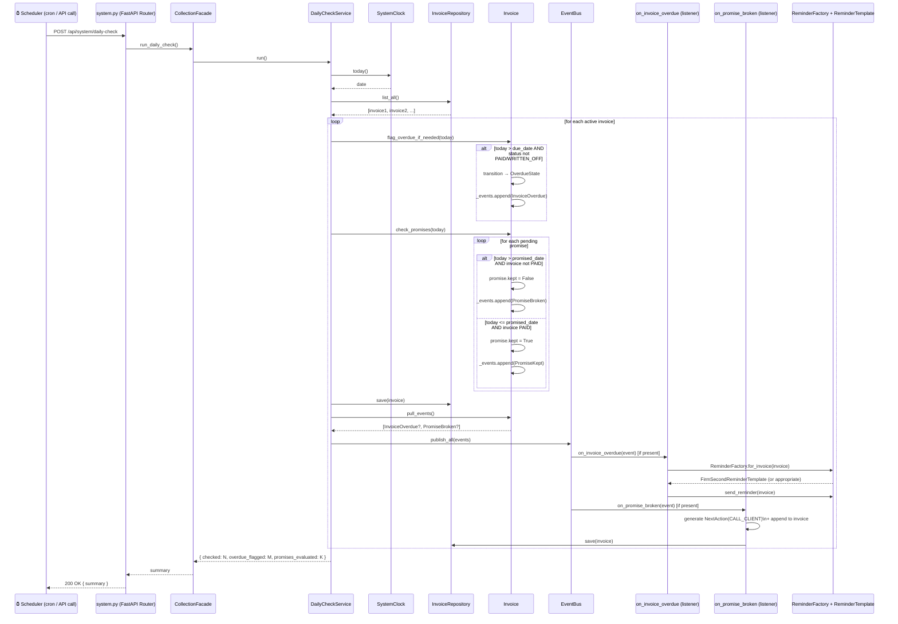

# UML Diagram 07 — Sequence: Daily Check

```mermaid
sequenceDiagram
    participant Scheduler as ⏰ Scheduler (cron / API call)
    participant Router as system.py (FastAPI Router)
    participant Facade as CollectionFacade
    participant DailyCheck as DailyCheckService
    participant Clock as SystemClock
    participant InvoiceRepo as InvoiceRepository
    participant Inv as Invoice
    participant Bus as EventBus
    participant L1 as on_invoice_overdue (listener)
    participant L2 as on_promise_broken (listener)
    participant Reminder as ReminderFactory + ReminderTemplate

    Scheduler ->> Router: POST /api/system/daily-check
    Router ->> Facade: run_daily_check()
    Facade ->> DailyCheck: run()
    DailyCheck ->> Clock: today()
    Clock -->> DailyCheck: date

    DailyCheck ->> InvoiceRepo: list_all()
    InvoiceRepo -->> DailyCheck: [invoice1, invoice2, ...]

    loop for each active invoice
        DailyCheck ->> Inv: flag_overdue_if_needed(today)
        alt today > due_date AND status not PAID/WRITTEN_OFF
            Inv ->> Inv: transition → OverdueState
            Inv ->> Inv: _events.append(InvoiceOverdue)
        end

        DailyCheck ->> Inv: check_promises(today)
        loop for each pending promise
            alt today > promised_date AND invoice not PAID
                Inv ->> Inv: promise.kept = False
                Inv ->> Inv: _events.append(PromiseBroken)
            else today <= promised_date AND invoice PAID
                Inv ->> Inv: promise.kept = True
                Inv ->> Inv: _events.append(PromiseKept)
            end
        end

        DailyCheck ->> InvoiceRepo: save(invoice)
        DailyCheck ->> Inv: pull_events()
        Inv -->> DailyCheck: [InvoiceOverdue?, PromiseBroken?]
        DailyCheck ->> Bus: publish_all(events)

        Bus ->> L1: on_invoice_overdue(event) [if present]
        L1 ->> Reminder: ReminderFactory.for_invoice(invoice)
        Reminder -->> L1: FirmSecondReminderTemplate (or appropriate)
        L1 ->> Reminder: send_reminder(invoice)

        Bus ->> L2: on_promise_broken(event) [if present]
        L2 ->> L2: generate NextAction(CALL_CLIENT)\n+ append to invoice
        L2 ->> InvoiceRepo: save(invoice)
    end

    DailyCheck -->> Facade: { checked: N, overdue_flagged: M, promises_evaluated: K }
    Facade -->> Router: summary
    Router -->> Scheduler: 200 OK { summary }
```
