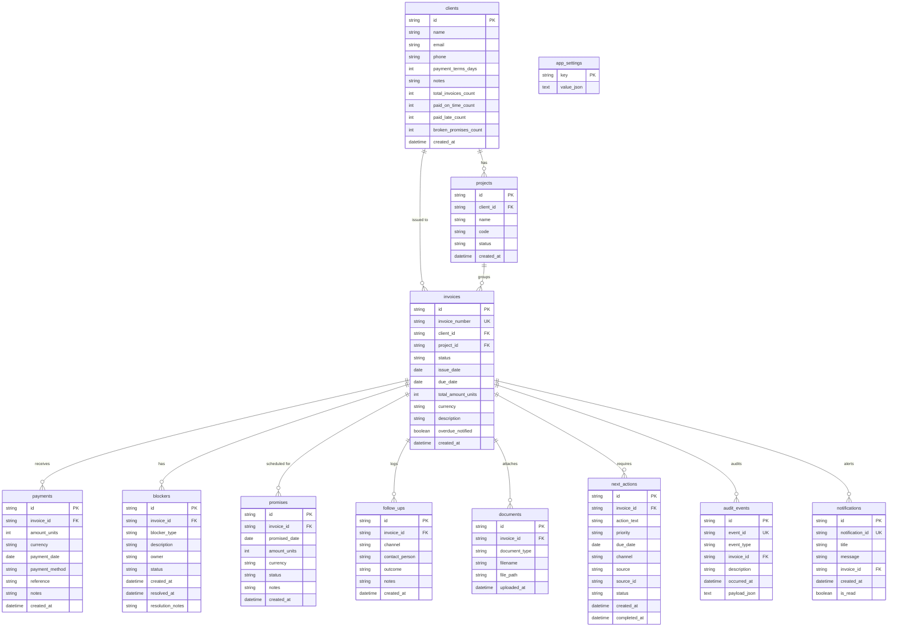

# UML Diagram 09 — Entity-Relationship (ER) Diagram

Represents the physical relational schema mapped in `backend/app/infrastructure/orm_models.py`.

```mermaid
erDiagram
    clients ||--o{ projects : "has"
    clients ||--o{ invoices : "issued to"
    projects ||--o{ invoices : "groups"
    invoices ||--o{ payments : "receives"
    invoices ||--o{ blockers : "has"
    invoices ||--o{ promises : "scheduled for"
    invoices ||--o{ follow_ups : "logs"
    invoices ||--o{ documents : "attaches"
    invoices ||--o{ next_actions : "requires"
    invoices ||--o{ audit_events : "audits"
    invoices ||--o{ notifications : "alerts"

    clients {
        string id PK
        string name
        string email
        string phone
        int payment_terms_days
        string notes
        int total_invoices_count
        int paid_on_time_count
        int paid_late_count
        int broken_promises_count
        datetime created_at
    }

    projects {
        string id PK
        string client_id FK
        string name
        string code
        string status
        datetime created_at
    }

    invoices {
        string id PK
        string invoice_number UK
        string client_id FK
        string project_id FK
        string status
        date issue_date
        date due_date
        int total_amount_units
        string currency
        string description
        boolean overdue_notified
        datetime created_at
    }

    payments {
        string id PK
        string invoice_id FK
        int amount_units
        string currency
        date payment_date
        string payment_method
        string reference
        string notes
        datetime created_at
    }

    blockers {
        string id PK
        string invoice_id FK
        string blocker_type
        string description
        string owner
        string status
        datetime created_at
        datetime resolved_at
        string resolution_notes
    }

    promises {
        string id PK
        string invoice_id FK
        date promised_date
        int amount_units
        string currency
        string status
        string notes
        datetime created_at
    }

    follow_ups {
        string id PK
        string invoice_id FK
        string channel
        string contact_person
        string outcome
        string notes
        datetime created_at
    }

    documents {
        string id PK
        string invoice_id FK
        string document_type
        string filename
        string file_path
        datetime uploaded_at
    }

    next_actions {
        string id PK
        string invoice_id FK
        string action_text
        string priority
        date due_date
        string channel
        string source
        string source_id
        string status
        datetime created_at
        datetime completed_at
    }

    audit_events {
        string id PK
        string event_id UK
        string event_type
        string invoice_id FK
        string description
        datetime occurred_at
        text payload_json
    }

    notifications {
        string id PK
        string notification_id UK
        string title
        string message
        string invoice_id FK
        datetime created_at
        boolean is_read
    }

    app_settings {
        string key PK
        text value_json
    }
```
