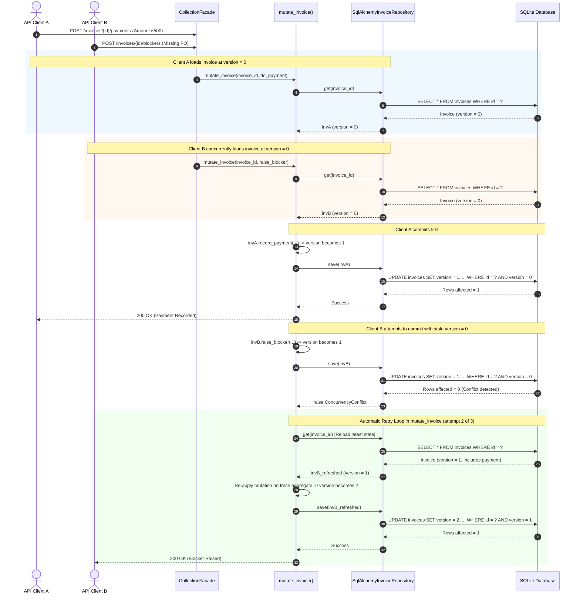

# UML Diagram 10 — Optimistic Locking & Retry Sequence

Illustrates the optimistic concurrency control mechanism implemented via the `version: int` column and `mutate_invoice()` helper.

```mermaid
sequenceDiagram
    autonumber
    actor ClientA as API Client A
    actor ClientB as API Client B
    participant Facade as CollectionFacade
    participant Helper as mutate_invoice()
    participant Repo as SqlAlchemyInvoiceRepository
    participant DB as SQLite Database

    ClientA->>Facade: POST /invoices/{id}/payments (Amount £500)
    ClientB->>Facade: POST /invoices/{id}/blockers (Missing PO)

    rect rgb(240, 248, 255)
        note over ClientA, Repo: Client A loads invoice at version = 0
        Facade->>Helper: mutate_invoice(invoice_id, do_payment)
        Helper->>Repo: get(invoice_id)
        Repo->>DB: SELECT * FROM invoices WHERE id = ?
        DB-->>Repo: Invoice (version = 0)
        Repo-->>Helper: invA (version = 0)
    end

    rect rgb(255, 248, 240)
        note over ClientB, Repo: Client B concurrently loads invoice at version = 0
        Facade->>Helper: mutate_invoice(invoice_id, raise_blocker)
        Helper->>Repo: get(invoice_id)
        Repo->>DB: SELECT * FROM invoices WHERE id = ?
        DB-->>Repo: Invoice (version = 0)
        Repo-->>Helper: invB (version = 0)
    end

    note over Helper, DB: Client A commits first
    Helper->>Helper: invA.record_payment(...) -> version becomes 1
    Helper->>Repo: save(invA)
    Repo->>DB: UPDATE invoices SET version = 1, ... WHERE id = ? AND version = 0
    DB-->>Repo: Rows affected = 1
    Repo-->>Helper: Success
    Helper-->>ClientA: 200 OK (Payment Recorded)

    note over Helper, DB: Client B attempts to commit with stale version = 0
    Helper->>Helper: invB.raise_blocker(...) -> version becomes 1
    Helper->>Repo: save(invB)
    Repo->>DB: UPDATE invoices SET version = 1, ... WHERE id = ? AND version = 0
    DB-->>Repo: Rows affected = 0 (Conflict detected)
    Repo-->>Helper: raise ConcurrencyConflict

    rect rgb(240, 255, 240)
        note over Helper, DB: Automatic Retry Loop in mutate_invoice (attempt 2 of 3)
        Helper->>Repo: get(invoice_id) [Reload latest state]
        Repo->>DB: SELECT * FROM invoices WHERE id = ?
        DB-->>Repo: Invoice (version = 1, includes payment)
        Repo-->>Helper: invB_refreshed (version = 1)
        Helper->>Helper: Re-apply mutation on fresh aggregate -> version becomes 2
        Helper->>Repo: save(invB_refreshed)
        Repo->>DB: UPDATE invoices SET version = 2, ... WHERE id = ? AND version = 1
        DB-->>Repo: Rows affected = 1
        Repo-->>Helper: Success
        Helper-->>ClientB: 200 OK (Blocker Raised)
    end
```
